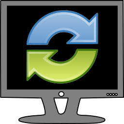
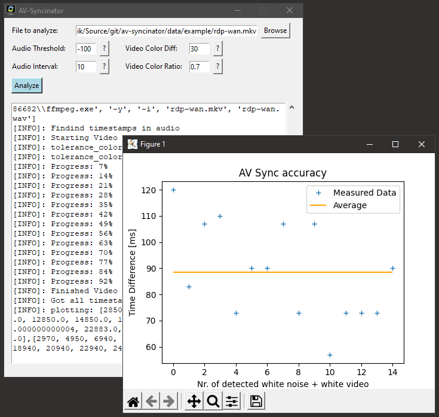

# AV-Syncinator

[][LICENSE]
[][BUILD]

AV-Syncinator is a small utility to measure
[Audio-Video-Synchronization](https://en.wikipedia.org/wiki/Audio-to-video_synchronization).
It works by analyzing a recording of the playback of a specifically prepared
video file. It was created to be used in the context of remote desktop systems
(such as RDP, VNC, etc.), although other applications are conceivable.

## Usage

1. Download `data/testvid.mp4`.
2. Play `testvid.mp4` on the system you wish to analyze. Then record the
   playback. As an example, the file in `data/example/rdp-wan.mkv` contains an
   [OBS](https://obsproject.com/) recording of `testvid.mp4` being played back
   over an RDP connection over a Wide Area Network.
3. Start AV-Syncinator
4. Click "Browse" and locate your recording
5. Click "Analyze"

After some time, you will see a plot of the results:

## Building

### Windows

Windows binaries can only be built on Windows systems. If you are running
Windows, the process is as follows:

1. Install a compatible version of Python (3.9, 3.8 or 3.7)
2. Clone the repository
3. Make a python virtual env with `py -m venv .pyenv`
4. Activate the venv with `.pyenv\Scripts\activate`
5. Install all the dependencies with `pip install -r avsyncinator/requirements.txt`
6. Run `py make.py windows`

This will produce two portable executables in the`build\windows\dist` folder,
one for the GUI and one for the CLI.

### GNU/Linux

In order to be able to build Linux executables from any platform, it was decided
to build Linux binaries through docker. The process for building linux binaries
is as follows:

1. Install a compatible version of Python (3.9, 3.8 or 3.7)
2. Install docker. On Linux, this can be done through your systems package
   manager. On Windows and macOS, you can download "docker-dekstop".
3. Run `py make.py gnu_linux`

This will produce two AppImages in the`build\gnu_linux\dist` folder,
one for the GUI and one for the CLI.

### Docker

A docker image of the CLI can also be built. This is currently the only
supported way to run AV-Syncinator on macOS. The process is as follows:

1. Install a compatible version of Python (3.9, 3.8 or 3.7)
2. Install docker. On Linux, this can be done through your systems package
   manager. On Windows and macOS, you can download "docker-dekstop".
3. Run `py make.py docker`

The image can then be run with `docker run av-syncinator`.

[More documentation will follow.]

[LICENSE]: https://github.com/dominiksta/av-syncinator/blob/master/LICENSE
[BUILD]: https://github.com/dominiksta/av-syncinator/actions
